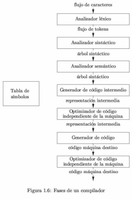
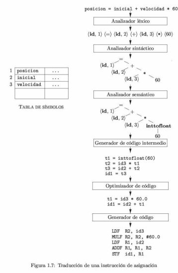

# Conceptos y operaciones básicas.

1. **¿Qué es un símbolo?**   
El bloque más pequeño de construcción. 

2. **¿Qué es un Alfabeto?**   
Un conjunto finito de símbolos. Se representa con **∑**.   

3. **¿Qué es una Cadena?**   
Es una secuencia finita de símbolos del alfabeto.

4. **¿Qué es un Conjunto?**   
Una colección de elementos con caracteristicas similares considerada como un
objeto. **{0, 1, 2}**

5. **¿Qué es el Límite de una cadena?**   
Se expresa como el "exponencial" del nombre del conjunto.   
Ejemplo: **∑¹ = {0, 1, 2}**, **∑² = {00, 11, 22}**.

6. **¿Cómo se representa un conjunto vacío?**   
Con la letra griega ε (Épsilon).

7. **¿Qué es la longitud?**   
El número de símbolos que componen la cadena.

## Límite de una cadena.

**∑ = {a, b, c}**   
∑⁰ = ε   
∑¹ = {a, b, c}
∑² = {aa, ab, ac, ba, bb, bc, ca, cb, cc}   
∑³ = {aaa, aab, aac, aba, abb, abc, aca, acb, acc, baa, bab, bac, bba, bbb,
bbc, bca, bcb, bcc, caa, cab,cac, cba, cbb, cbc, cca, ccb, ccc}

**Cerradura positivo.**

**∑⁺** = Todas las combinaciones, a excepción de la cadena vacía.   
**∑⁺** = { a, b, c, aa, ab, ac, ba, bb, bc, ca, cb, cc, aaa, aab, aac}   
**∑⁺** = ∑¹U∑²U∑³U...

**Cerradura de _Kleene_.**

<b>∑*</b> = Todas las combinaciones con todo y cadena vacía.   
<b>∑*</b> = {ε, a, b, c, aa, ab, ac, ba, bb, bc, ca, cb, cc, aaa, aab, aac}   
<b>∑*</b> = ∑⁰U∑¹U∑²U∑³U...

## Concatenación de cadenas.

**∑ = {0, 1}**

w = 1010   
x = 010   
y = 01   
z = 111   

Para representar la **longitud**: |w| = 4

wx = 1010010  | Son lo mismo   
w∙x = 1010010|

yz = 01111   
wz = 1010111   

## Términos para partes de cadenas.

- **Prefijo**: Se eliminan cero o más símbolos al final de _s_. Por ejemplo, **ban**, **banana**, **ε**.
- **Sufijo**: Se eliminan cero o más símbolos al principio de _s_. Por ejemplo,
   **nana**, **banana**, **ε**.
- **Subcadena**: Se elimina cualquier prefijo o sufijo de _s_. Por ejemplo,
   **banana**, **nan**, **ε**.

**w = banana**  ∑ = {a, b, n}

| Prefijo    | Sufijo     | Subcadena  |
| -------    | ------     | ---------  |
| **ε**      | **ε**      | **ε**      |
| b          | a          | **banana** |
| ba         | na         | nan        |
| ban        | ana        | anan       |
| **banana** | **banana** | ban        |

## Operaciones en lenguajes.

|      **OPERACIÓN**       | **DEFINICIÓN Y NOTACIÓN**              |
| ------------------------ | -------------------------------------- |
| Unión de L y M           | L U M = {s | s está en L o está en M}  |
| Concatenación de L y M   | LM = {st | s está en L y t está en M}  |
| Cerradura de Kleene de L | L* = U de infinito e i=0 L^i           |
| Cerradura positivo de L  | L⁺   U hasta infinito e i=1 L^i        |

Sea L el conjunto de las letras _{A, B, C, ..., Z, a, b, c, ..., z}_ y sea D el conjunto de dígitos _{0, 1, ..., 9}_.  

1. **L U D** es el conjunto de letras y dígitos; hablando en sentido estricto,
el lenguaje con **62 cadenas** de longitud de uno, y cada una de las cadenas es una letra o un dígito.   
**L U D** = _{ A, B, C, D, E, F, G, G, H, I, J, K, L, M, N, Ñ, O, P, Q, R, S, T,
 U, V, W, X, Y, Z, a, b, c, d, e, f, g, h, i, j, k, l, m, n, ñ, o, p, q, r, s,
t, u, v, w, x, y, z, 0, 1, 2, 3, 4, 5, 6, 7, 8, 9}_

2. **LD** es el conjunto de **520 cadenas** de longitud dos, cada una de las cuales consiste en una letra, seguida de un digito.   
**LD** = _{A0, A1, A2, A3, A4, A5, c1, c2, c4, ..., z9}_

3. **L⁴** es el conjunto de todas las cadenas de 4 letras.   
**L⁴** = _{Aaaa, keko, kaka, reba, arch, okek, akak}_

4. **L*** es el conjunto de todas las cadenas de letras, incluyendo **ε**, la
cadena vacía.   
**L*** = _{ε, A, B, C, AA, keko, ..., z}_

5. **L(L U D)*** es el conjunto de todas las cadenas de letras y digitos que
empizan con una letra.   
**L(L U D)*** = {AA9, bε, xD777, kekokaka5, abc123, Aa8}

6. **D⁺** es el conjunto de todas las cadenas de uno o más digitos.   
**D⁺** = {0, 10000, 777, 666, 100000, 88887, 231, 664, 34121323}

## Lenguajes con restricciones.

### **∑ = {a, b, n}**   
L = {w | descripción de w}

**L1 = {w | w termina con a}**   
L1 = {a, ba, bba, aa, aaa, ababa, abbbba}

**L2 = {w | w termina con a y empieza con b}**   
L2 = {ba, bba, baaa, bbba, bbaa, babababababaaba}

**L3 = {w | w tiene el mismo número de a y b}**   
L3 = {abab, aaabbb, aaaaaabbbbb, ab, aaaabbbb, aaaaaabbbbbb}

**L4 = {w | w tiene el mismo número de a y b, donde las b van seguidas de todas
las a}**   
L4 = {ab, aabb, aaabbb, aaaabbbb}

**L5 = {w | w tiene una longitud de 3}**   
L5 = {aaa, aab, aba, abb, baa, bab, bba, bbb}

### **∑ = {a, b, c, d}**

**L1 = {w | w tiene como prefijo ab}**   
L1 = {abbab, abcd, abb, ab, abba, abbcd}

**L2 = {w | w tiene como subcadena bcd}**      
L2 = { bbcdd, cbcdaa, abcd, bcd, aaabcd, bbbbcdac}

**L3 = {w | w es un palíndromo}**   
L3 = {aa, aaabaaa, acddca, abcddcba, acdccdca, bbaabb}

**L4 = {w | w tiene como sufijo abc}**   
L4 = {ccdabc, abcabc, abc, bccabc, accbcabc, ccabc}   

### **∑ = {0, 1}**

**L1 = {w | w es un número binario del 1 al 9}**   
L1 = {1, 10, 11, 100, 101, 110, 111, 1000, 1001}

# Teorías.

1. **¿Qué es la teoría de la complejidad?**   
Habla de las **diferentes dificultades** de los problemas informaticos. Se
clasifica en 4 pasos.
    - Primero, entender **cuál es la raíz de la dificultad del problema**, para
poder ser capaz de alterarlo y que resulte más fácil de resolver.
    - Segundo, si se puede **establecer por lo menos una solución casi
perfecta** al problema. En ciertos casos, encontrar soluciones que sólo se
aproximen al perfecto es relativamente fácil.
    - Tercero, en algunos problemas, **sólo supeor caso es díficil, pero
faciles en la mayoría**.
    - Finalmente, puedes **considerar alternativas de computación como la
computación aleatoria**.

2. **¿Qué es la teoría de la computabilidad?**   
Turing y Church descubrieron que **varios problemas no pueden ser resolvidos
por computadoras**. Se enfoca especialmente en **clasificar los problemas como
solucionables o no**.

3. **¿Qué es la teoría del autómata?**   
Habla de dos modelos matemáticos:
    - **Autómata finito**: Para procesamiento de texto, compiladores, diseño de
       hardware, etc..
    - **Grámatica libre de contexto**: Para lenguajes de programación
       e inteligencia artificial.

# Compilador e Intérprete.

1. **¿Qué es un compilador?**   
Un traductor que tiene como entrada una sentencia de lenguaje formal y como
salida tiene un fichero ejecutable, es decir, realiza una traducción de un
código de alto nivel a código máquina.

2. **¿Cuál es la estructura de un compilador?**   
_programa fuente_ **->** | Compilador | **->** _programa destino_

3. **¿Cuáles son las fases de un compilador?**   

4. **Explica las fases de un compilador:**  
    - **Analizador Léxico**: Lee, clasifica, analiza y guarda los símbolos
       o letras en la tabla de símbolos.
    - **Analizador Sintáctico**: Jerarquía y prioridad de cada token
       o sentencia, valida que sea correcta cada línea.
    - **Analizador Semántico**: Verifica que los tipos de datos/semántica sean
       correctos. Por ejemplo que en un dato tipo _int_ no se guarden datos
tipo _char_.
    - **Generador de código intermedio**: El compilador genera un código
       intermedio para el equipo destino. Está generado de tal manera que hace
más fácil de traducir a la máquina destino.
    - **Optimizador de código**: Se asume como la acción de eliminar código
       innecesario, y organiza la secuencia de declaraciones con el fin de
acelerar la ejecución del programa.
    - **Generador de código**: Recibe el código intermedio optimizado y la
       asigna al lenguaje destino. Si el lenguaje destino es lenguaje máquina
se seleccionan registros o ubicaciones de memoria para las variables que
utiliza el programa.
    
5. **A ver, dame un ejemplo de esas fases:**   

6. **¿Qué es un intérprete?**   
Otro tipo de procesador de lenguaje. En vez de producir un programa destino, el
intérprete nos da la apariencia de ejecutar directamente las operaciones en el
programa origen con las entradas proporcionadas por el usuario.

7. **¿Cuál es la estructura de un intérprete?**   
_programa fuente_ **->** | Intérprete | **->** _salida_   
_entrada_       **->**  

8. **¿Cuál es la estuctura de un traductor?**   
_Entrada_ **->** | Proceso | **->** _Salida_

9. **¿Cuál es la diferencia entre un compilador y un intérprete?**   
El compilador lee todas las líneas a la vez y el intérprete lee una por una.

# Lenguajes formales.

1. **¿Qué es un lenguaje formal?**   
Conjunto de palabras de longitud finita formada de un alfabeto.

2. **¿Qué es un lenguaje regular?**   
Los lenguajes más sencillos que se consideran son los lenguajes regulares, es
decir, los que se pueden generar a partir de los lenguajes básicos, con la
aplicación de las operaciones de unión, concatenación y * de Kleene un número
finito de veces.

3. **¿Qué es la jerarquía de Chomsky?**   
Es una clasificación jerárquica de los distintos tipos de grámaticas formales
que generar lenguajes formales.

4. **¿Cuáles son las jerarquías de Chomsky?**   
    - **Grámaticas de tipo 0 (sin restricciones)**: Incluye todas las
       grámaticas formales que son capaces de ser reconocidos por una máquina
de Turing.
    - **Grámaticas de tipo 1 (sensible al contexto)**: Permite que el "papel"
       de las palabras dependa de la posición en que pertenezcan.
    - **Grámaticas de tipo 2 (grámaticas libres del contexto)**: En ellas el
       significado de una palabra es independiente del lugar que ocupa en la
frase.
    - **Grámaticas de tipo 3 (lenguajes regulares)**: Son los que representan
       una estructura más sencilla.

    

# Herramientas de construcción de compiladores.

1. **Generadores de analizadores sintácticos (parsers)**: producen de manera
automática analizadores sintácticos a partir de una descripción gramatical de
un lenguaje de programación.

2. **Generadores de escáneres**: producen analizadores léxicos a partir de una
descripción de los tokens de un lenguaje utilizando expresiones regulares.

3. **Generadores de generadores de código**: producen un generador de código
a partir de una colección de reglas para traducir cada operación del lenguaje
intermedio en el lenguaje máquina para una máquina destino.
