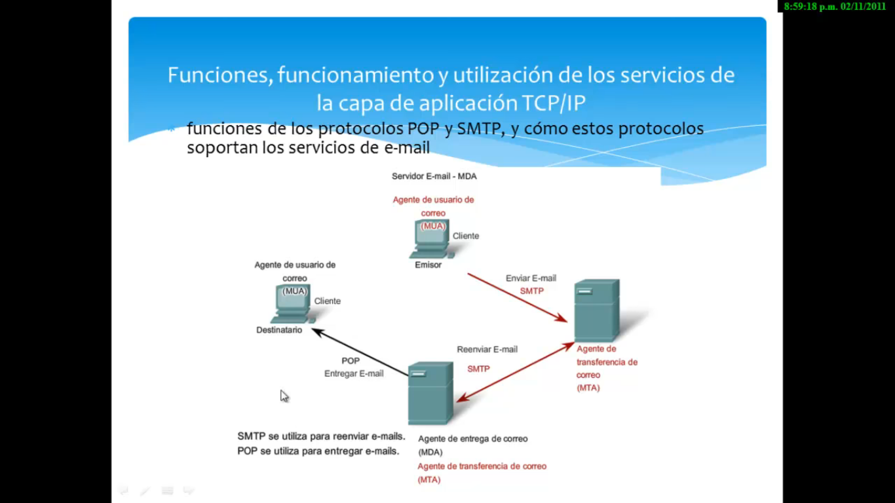

Antes de 
- HUB
- Bridge

**Broadcast**: La tarea del switch para difundir.

# Dominio de colisión.

Se conoce como dominio de colisión al espacio físico con un ancho de banda compartido por un conjunto de dispositivos. 

# HUB

- No segmenta dominio colisión
- No segmenta dominio de broadcast
- Half-duplex: Sólo se comunica con un equipo a la vez. (Atención serial).

Dominio de colección.   

El ancho de banda de este hub es de 100 MB/s. La velocidad de este se divide
entre la cantidad de equipos.

# Bridge

- Software base
- Aprenden las direcciones MAC origen
- Segmentan el dominio de colisión.

:max_bytes(150000):strip_icc()/how-network-bridges-work-816357-final-ac-5c48a9f446e0fb000125125b.png)

El bridge contiene una tabla de las MAC de los dispositivos y está almacenado
en una memoria nvRAM.

Una dirección MAC origen es el equipo donde se manda la información; así el
bridge escribe en su tabla la MAC.

Trabaja en modo Half-Duplex.

# Switch.

Trabaja en Full-Duplex o en Half-Duplex.

El dominio de colision es cada VLAN1.

El Switch también contiene una tabla almacenada en una nvRAM.

**VLAN1**:  Se especifica qué puertos del switch pertenecen a la VLAN, los miembros de dicha VLAN son los que se conecten a esos puertos. No permite la movilidad de los usuarios, habría que reconfigurar las VLAN si el usuario se mueve físicamente.

# ICMP

El protocolo de control de mensajes de Internet es parte del conjunto de protocolos IP. Es utilizado para enviar mensajes de error e información operativa indicando, por ejemplo, que un host no puede ser localizado o que un servicio que se ha solicitado no está disponible. 

# PDU

Las unidades de protocolo de datos, también llamadas PDU, se utilizan para el intercambio de datos entre unidades disparejas, dentro de una capa del modelo OSI. Existen dos clases: PDU de datos, que contiene los datos del usuario principal o la PDU del nivel inmediatamente inferior.

# MUA

Mail User Agent

# MTA

Agente de transferencia de correo

# MDA

Agente de entrega de correo

# TELNET

Telnet proporciona una forma de utilizar una computadora, conectada a través de
la red, para acceder a un dispositivo de red como si el teclado y el monitor
estuvieran conectados directamente al dispositivo. 

Trabaja en el puerto 23

# SSH

Secure Shell.

Trabaja en el puerto 22.

# P2P

